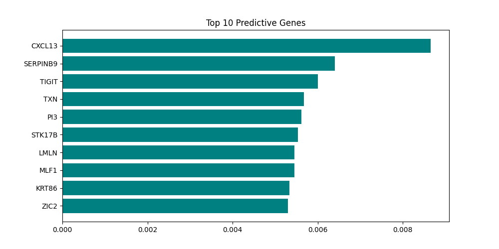
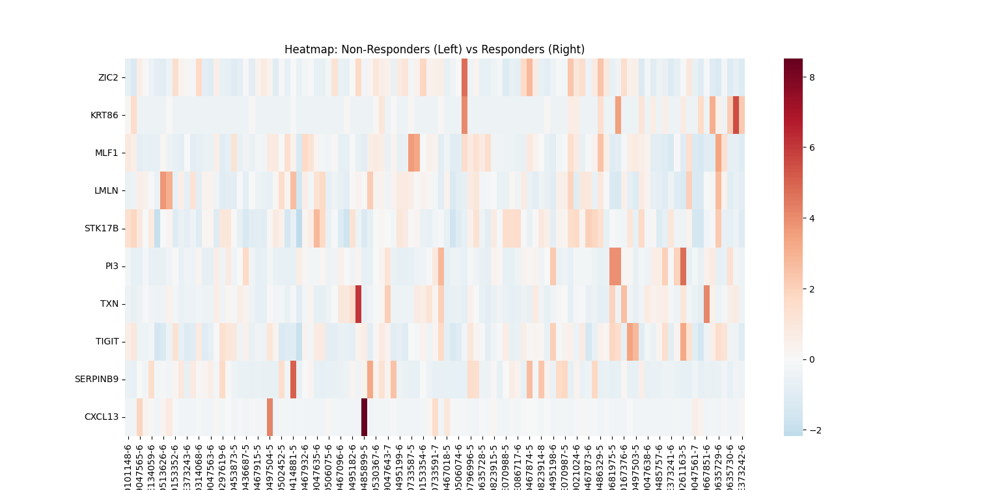
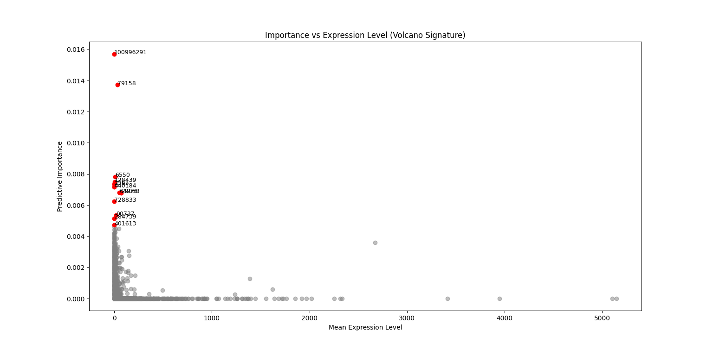
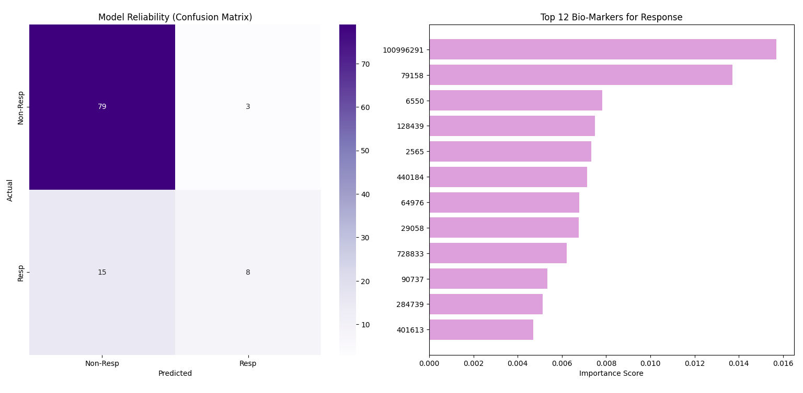

# Immunotherapy-response-prediction
Overview

This project explores how machine learning can be used to understand and predict immunotherapy response using gene expression data.
Using the GSE91061 dataset, I built a predictive model and further analyzed the biological significance of key genes contributing to the model’s decisions.
Beyond model performance, the focus of this project is on extracting meaningful biological insights from high-dimensional data.

Objectives

Predict patient response to immunotherapy using gene expression profiles
Identify top 10 predictive genes driving model decisions

-Data Processing

Loaded and cleaned gene expression dataset (GSE91061).
Handled missing values and structured data for modeling. 

-Model Development

Trained a Random Forest Classifier.
Evaluated using accuracy, precision, recall, and F1-score.
Improved Bias using SMOTE. 

Results 

Top 10 genes 

Top genes such as CXCL13 and TIGIT show strong influence on model predictions, suggesting their potential role in immune response.

Gene expression Heatmap

The heatmap highlights variation in gene expression across samples, revealing distinct patterns between response groups.

Volcano plot (Gene Signature)

This plot shows differentially expressed genes, helping identify significant biomarkers associated with treatment response.

Model performance and Biomarker Analysis 

The model demonstrates reliable classification performance while identifying biologically relevant markers.
